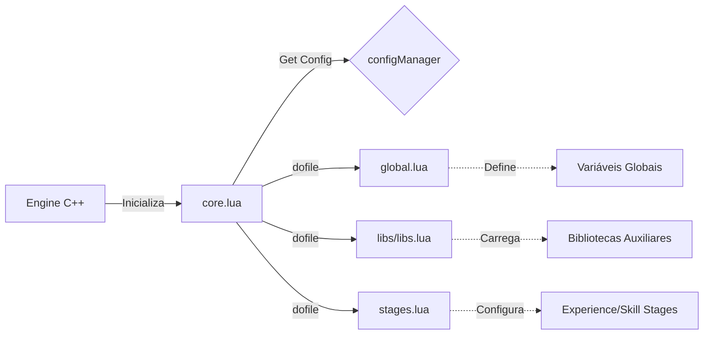

## 🛠️ Informações do Arquivo

Este arquivo atua como o inicializador central do ambiente Lua do servidor (OTServ), responsável por definir os caminhos dos diretórios principais e carregar os módulos essenciais em sequência. É a espinha dorsal que conecta as configurações globais, bibliotecas e regras de progressão (stages) ao motor do jogo.

<ResponseField name="Caminho Original" type="path">
  `server/data/core.lua`
</ResponseField>

<Tip>
  Este arquivo é um ponto de entrada crítico. A ordem das chamadas `dofile` aqui estabelece a hierarquia de dependências para todos os outros scripts do servidor.
</Tip>

## 📄 Visão Geral do Código

### Resumo Executivo

O `core.lua` inicializa o ambiente de script recuperando configurações de diretório do motor C++ e carregando arquivos Lua fundamentais. Sua importância é vital, pois garante que variáveis globais, bibliotecas e configurações de experiência estejam disponíveis antes que qualquer sistema de jogo seja ativado.

### Fluxo de Execução

Este arquivo é executado pelo motor do servidor durante a fase de inicialização (startup). Ele orquestra o carregamento de outros componentes vitais.



### Análise de Lógica do Script

Como este arquivo é um script de execução linear e não uma coleção de funções, a análise foca nas operações realizadas linha a linha:

1. **Definição de Diretórios Base**:
   - **Operação**: `configManager.getString(configKeys.DATA_DIRECTORY)` e `CORE_DIRECTORY`.
   - **Propósito**: Estabelece as variáveis globais `DATA_DIRECTORY` e `CORE_DIRECTORY` que serão usadas por outros scripts para localizar arquivos.
   - **Lógica**: Busca os valores definidos no `config.lua` (ou equivalente em C++) através da interface `configManager`.
2. **Carregamento do Ambiente Global**:
   - **Operação**: `dofile(CORE_DIRECTORY .. "/global.lua")`.
   - **Propósito**: Executa o arquivo `global.lua`.
   - **Impacto**: Disponibiliza constantes, funções utilitárias globais e configurações de servidor (como `SERVER_NAME`, `IsRetroPVP`) para todo o sistema.
3. **Carregamento de Bibliotecas**:
   - **Operação**: `dofile(CORE_DIRECTORY .. "/libs/libs.lua")`.
   - **Propósito**: Carrega funções auxiliares e bibliotecas estendidas.
4. **Carregamento de Estágios (Stages)**:
   - **Operação**: `dofile(CORE_DIRECTORY .. "/stages.lua")`.
   - **Propósito**: Define as tabelas de experiência, skills e magic level.
   - **Impacto**: Configura a curva de progressão do jogo (ex: `experienceStages`).

### Exemplo de Uso

Este arquivo não é "chamado" por outros scripts Lua, mas sim executado automaticamente. Abaixo está o conteúdo típico e como ele estrutura o carregamento:

```lua core.lua
-- Implementação técnica de: core.lua
-- Localização: server/data/core.lua

-- 1. Recupera caminhos configurados no config.lua
DATA_DIRECTORY = configManager.getString(configKeys.DATA_DIRECTORY)
CORE_DIRECTORY = configManager.getString(configKeys.CORE_DIRECTORY)

-- 2. Carrega o ambiente global (variáveis, constantes, eventos globais básicos)
dofile(CORE_DIRECTORY .. "/global.lua")

-- 3. Carrega bibliotecas de funções (libs)
dofile(CORE_DIRECTORY .. "/libs/libs.lua")

-- 4. Carrega configurações de estágios de experiência e skills
dofile(CORE_DIRECTORY .. "/stages.lua")
```

### Observações Técnicas

- **Dependências de C++**: O script depende estritamente que o objeto `configManager` e o enum `configKeys` já estejam expostos pelo motor do servidor (Source Code) antes da execução deste arquivo.
- **Sistema de Arquivos**: Utiliza caminhos absolutos ou relativos baseados na configuração do servidor. Se `CORE_DIRECTORY` estiver configurado incorretamente no `config.lua`, o servidor falhará ao iniciar (crash) pois não encontrará os arquivos subsequentes.
- **Ordem de Execução**: A ordem é intencional. `global.lua` deve vir primeiro para que `libs.lua` ou `stages.lua` possam usar variáveis globais se necessário (embora `stages.lua` seja geralmente independente).

### Alertas

- ⚠️ **Caminhos Incorretos**: Alterar a estrutura de pastas do servidor sem atualizar as chaves `DATA_DIRECTORY` ou `CORE_DIRECTORY` no `config.lua` quebrará este script imediatamente.
- ⚠️ **Dependência Circular**: Evite adicionar `dofile` neste arquivo que aponte para scripts que tentem carregar o `core.lua` novamente.
- ⚠️ **Falha Crítica**: Se qualquer um dos arquivos referenciados (`global.lua`, `libs.lua`, `stages.lua`) contiver erros de sintaxe, o carregamento do servidor será abortado neste ponto.