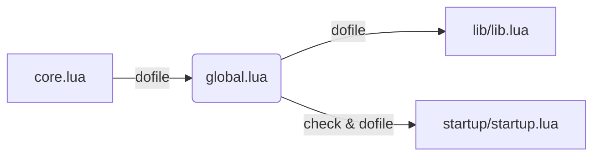

## 🛠️ Informações do Arquivo

Este arquivo é responsável por estabelecer o ambiente base do servidor Lua. Ele define constantes universais (como direções, estados de PVP), inicializa tabelas globais para sistemas complexos e carrega bibliotecas essenciais.

<ResponseField name="Caminho Original" type="path">
  `server/data/global.lua`
</ResponseField>

<Tip>
  Este arquivo foi mapeado automaticamente. Alterações aqui afetam o servidor globalmente. Cuidado ao modificar constantes de sistema como `DIRECTIONS_TABLE` ou `AUTH_TYPE`.
</Tip>

## 📄 Visão Geral do Código

### Resumo Executivo

O `global.lua` atua como a espinha dorsal da configuração em tempo de execução. Ele traduz configurações do `config.lua` (via `configManager`) para variáveis Lua globais e define a lógica de sistemas transversais, como a regeneração de Stamina em trainers e zonas de proteção.

### 📍 Fluxo de Carregamento

Entender a ordem de carregamento é crucial para saber quais variáveis estão disponíveis em cada etapa.

1. **Quem carrega este arquivo?**
   - Ele é executado pelo `server/data/core.lua` através da função `dofile`.
   - Isso ocorre logo no início da inicialização do datapack.
2. **Quem este arquivo carrega?**
   - `server/data/lib/lib.lua`: Carrega a biblioteca principal de funções auxiliares.
   - `server/data/startup/startup.lua`: Executa scripts de inicialização única (se o arquivo existir).



### Análise de Funções Principais

#### 1. `addStamina`

Gerencia a regeneração de stamina do jogador em duas situações: treinando em "Exercise Dummies" ou descansando em Zona de Proteção (PZ).

- **Parâmetros:**
  - `playerId` (Number | UserData): O ID ou objeto do jogador.
  - `...` (Varargs): Argumentos variáveis dependendo do contexto (delay, localPlayerId).
- **Lógica Interna:**
  - **Modo Trainer:** Verifica se o jogador está atacando o alvo correto ("Training Machine"). Se sim, adiciona stamina periodicamente e agenda o próximo evento recursivamente.
  - **Modo PZ:** Verifica se o jogador está em PZ. Se a stamina estiver na "Green Stamina" (40h-42h), o delay de regeneração é ajustado.
- **Retorno:** `true` se o evento foi agendado com sucesso, `false` caso contrário.

#### 2. `IsRetroPVP` / `IsTravelFree`

Wrappers (envoltórios) simples para verificar configurações do `config.lua`.

- **Propósito:** Facilitar a leitura do código em outros scripts, evitando chamadas longas ao `configManager`.
- **Retorno:** Boolean (`true` ou `false`).

### Estruturas de Dados Globais

O arquivo inicializa tabelas vazias para garantir que sistemas em outros arquivos não encontrem valores `nil`.

- `_G.GlobalBosses`: Armazena estado de bosses globais.
- `_G.OnExerciseTraining`: Controla jogadores treinando.
- `ropeSpots` / `specialRopeSpots`: Lista de IDs de itens onde a corda pode ser usada.
- `swimmingTiles`: Lista de IDs de tiles onde o personagem muda para a outfit de natação.

### Exemplo de Uso

Como as variáveis definidas aqui são globais, você pode acessá-las em qualquer script (Actions, Movements, Globalevents) sem precisar de `require`.

```lua
-- Exemplo em um script de action qualquer
function onUse(player, item, fromPosition, target, toPosition, isHotkey)
    -- Usando uma constante definida no global.lua
    if PARTY_PROTECTION == 0 then
        player:sendTextMessage(MESSAGE_STATUS_CONSOLE_BLUE, "Cuidado! Party Protection está DESATIVADO.")
    end

    -- Verificando se um tile é de natação usando a tabela global
    if table.contains(swimmingTiles, item.itemid) then
        player:sendTextMessage(MESSAGE_INFO_DESCR, "Você pode nadar aqui!")
    end
    return true
end
```

### Observações Técnicas

- **Dependência do ConfigManager:** Muitas constantes (`SERVER_NAME`, `AUTH_TYPE`) dependem diretamente de valores carregados do C++ via `configManager`. Se o `config.lua` estiver mal configurado, este arquivo pode gerar erros ou comportamentos inesperados.
- **`Extensão de table:`** O arquivo injeta a função `table.contains` na biblioteca padrão `table` do Lua. Isso é útil, mas deve-se ter cuidado ao atualizar a versão do Lua ou do servidor para não haver conflitos de nomes.

### Alertas

<Warning>
  **Modificação de Constantes:** Alterar valores como `NORTH`, `SOUTH` ou `DIRECTIONS_TABLE` quebrará a lógica de movimentação e verificação de direção de todo o servidor.
</Warning>

<Warning>
  **Stamina Logic:** A função `addStamina` contém "números mágicos" (ex: `2520` para stamina cheia, `2340` para início da green stamina). Ao alterar as taxas de stamina no C++, lembre-se de atualizar esta lógica aqui para refletir os novos limites.
</Warning>

```lua global.lua
-- Trecho visual da lógica de Stamina
function addStamina(playerId, ...)
    -- ...
    local actualStamina = player:getStamina()
    if actualStamina > 2340 and actualStamina < 2520 then
        -- Lógica específica para Green Stamina
        delay = configManager.getNumber(configKeys.STAMINA_GREEN_DELAY) * 60 * 1000
    end
    -- ...
end
```