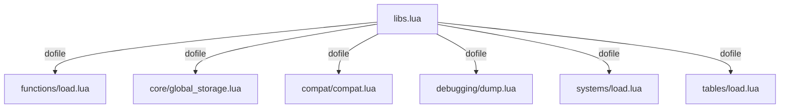

## 🛠️ Informações do Arquivo

Este arquivo atua como o carregador mestre das bibliotecas Lua do servidor. Ele orquestra a inclusão de funções essenciais, sistemas de compatibilidade, ferramentas de debug e utilitários de tabelas, garantindo que o ambiente global esteja preparado antes da execução dos scripts de jogo.

<ResponseField name="Caminho Original" type="path">
  `server/data/libs/libs.lua`
</ResponseField>

<Tip>
  A ordem de carregamento neste arquivo é intencional. Bibliotecas base (como functions) são carregadas antes de sistemas complexos que podem depender delas.
</Tip>

## 📄 Visão Geral do Código

### Resumo Executivo

O `libs.lua` é responsável por inicializar a infraestrutura de scripts do servidor. Ele carrega modularmente componentes vitais como o sistema de armazenamento global (`global_storage`), compatibilidade com versões antigas (`compat`) e carregadores de subsistemas (`systems/load.lua`).

### Fluxo de Execução

Executado pelo `core.lua`, este script carrega sequencialmente os seguintes módulos:



### Análise dos Módulos Carregados

1. **`Core Functions (libs/functions/load.lua)`**:
   - Carrega funções utilitárias básicas estendidas para o Lua.
2. **`Global Storage (libs/core/global_storage.lua)`**:
   - Implementa ou configura o sistema de armazenamento de dados persistentes ou voláteis globais.
3. **`Compatibility (libs/compat/compat.lua)`**:
   - Mantém suporte a scripts antigos, mapeando funções depreciadas para a nova API do TFS.
4. **`Debugging (libs/debugging/dump.lua)`**:
   - Ferramenta para desenvolvedores inspecionarem tabelas e variáveis em tempo de execução (`dump`).
5. **`Systems (libs/systems/load.lua)`**:
   - Carregador para sistemas de jogo específicos (ex: crafting, tasks).
6. **`Tables (libs/tables/load.lua)`**:
   - Carrega tabelas de dados estáticos ou configurações de loot/monstros.

### Exemplo de Uso

Para adicionar uma nova biblioteca customizada, recomenda-se seguir o padrão de diretórios ou adicionar diretamente aqui se for um arquivo único:

```lua
-- Exemplo: Adicionando uma lib de eventos customizados
dofile(CORE_DIRECTORY .. "/libs/meus_eventos.lua")
```

### Observações Técnicas

- **`Variável CORE_DIRECTORY`**: O script depende desta variável global definida no `core.lua` para localizar os arquivos.
- **Modularização**: O uso de arquivos `load.lua` dentro de subpastas (functions, systems, tables) sugere uma arquitetura organizada onde cada subsistema gerencia suas próprias dependências.

### Alertas

- ⚠️ **Dependências**: Se `functions/load.lua` falhar, scripts subsequentes como `compat.lua` podem quebrar se dependerem de funções básicas carregadas anteriormente.
- ⚠️ **Caminhos**: A estrutura de pastas deve ser rigorosamente mantida conforme definido nos `dofile`, caso contrário o servidor não iniciará.