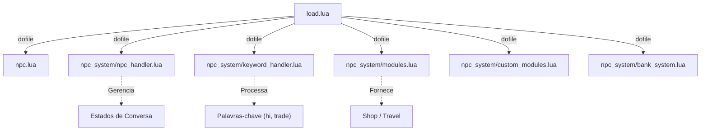

## 🛠️ Informações do Arquivo

Este arquivo é o carregador principal da biblioteca de NPCs (Non-Player Characters). Ele é responsável por inicializar o sistema de "NpcHandler", que gerencia estados de conversa, comércio e interações complexas entre jogadores e NPCs.

<ResponseField name="Caminho Original" type="path">
  `server/data/npclib/load.lua`
</ResponseField>

<Tip>
  Este sistema é a base para a maioria dos scripts de NPC estilo "Tibia Global" (baseado no sistema Jiddo), permitindo interações complexas sem reescrever código básico para cada NPC.
</Tip>

## 📄 Visão Geral do Código

### Resumo Executivo

O `load.lua` orquestra a inclusão dos componentes do sistema de NPCs. Ele carrega desde extensões básicas da classe `Npc` até módulos avançados de comércio e banco, garantindo que a API `NpcHandler` esteja disponível para os scripts individuais de cada NPC.

### Fluxo de Execução

Este arquivo é executado durante a inicialização do servidor (geralmente chamado pelo `libs.lua` ou `core.lua`).



### Análise dos Módulos Carregados

1. **`Extensões Básicas (npc.lua)`**:
   - Adiciona métodos auxiliares à classe `Npc` e funções globais como `MsgContains` e `MsgFind`.
2. **`Core do Sistema (npc_system/npc_handler.lua)`**:
   - Define a classe `NpcHandler`, que gerencia o foco (quem o NPC está atendendo), filas de mensagens e eventos de `onCreatureSay`.
3. **`Processador de Texto (npc_system/keyword_handler.lua)`**:
   - Lógica para detectar palavras-chave em frases complexas e navegar na árvore de diálogo.
4. **`Módulos Padrão (npc_system/modules.lua)`**:
   - Implementações prontas para lojas (`ShopModule`), viagens (`TravelModule`) e outros comportamentos comuns.
5. **Sistemas Específicos**:
   - `custom_modules.lua`: Ganchos para módulos criados pelo usuário.
   - `bank_system.lua`: Lógica dedicada para NPCs banqueiros (balance, deposit, withdraw).

### Exemplo de Uso

Este arquivo raramente precisa ser editado, a menos que você esteja instalando um novo módulo de NPC (ex: um sistema de crafting via NPC).

```lua
-- Exemplo: Adicionando um módulo de missões (quests) customizado
dofile(CORE_DIRECTORY .. "/npclib/npc_system/quest_module.lua")
```

### Observações Técnicas

- **Legado**: Este sistema é uma evolução do antigo sistema de NPCs do Jiddo, amplamente usado em servidores Open Tibia para simular o comportamento do Tibia real.
- **`Variável CORE_DIRECTORY`**: Assim como outros carregadores, depende desta global para caminhos absolutos.
- **Funções Globais**: O arquivo `npc.lua` carregado aqui define funções globais importantes como `MsgContains`, usadas em quase todos os scripts de NPC.

### Alertas

- ⚠️ **Ordem de Carregamento**: `npc_handler.lua` deve ser carregado antes dos módulos, pois os módulos herdam ou utilizam a estrutura do handler.
- ⚠️ **Dependências**: Scripts de NPC individuais (`data/npc/scripts/*.lua`) dependem estritamente que este arquivo tenha sido carregado com sucesso. Se falhar, os NPCs não responderão a "hi".