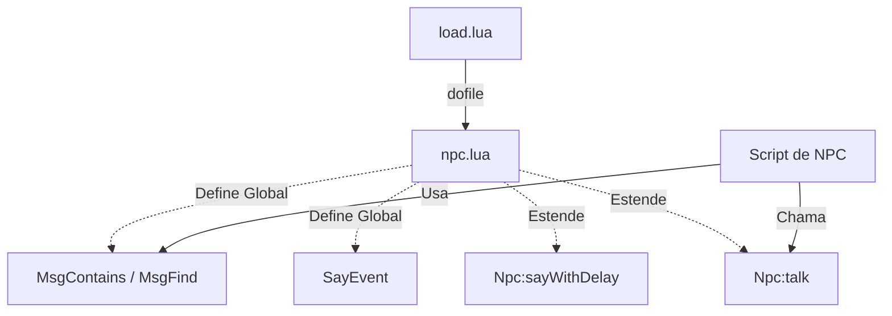

## 🛠️ Informações do Arquivo

Este arquivo estende a classe `Npc` (do motor C++) com funções auxiliares escritas em Lua. Ele também define funções globais críticas para o reconhecimento de texto (como `MsgContains`), que são usadas para detectar se um jogador disse uma palavra-chave específica.

<ResponseField name="Caminho Original" type="path">
  `server/data/npclib/npc.lua`
</ResponseField>

<Tip>
  A função `MsgContains` definida aqui é a base de toda a interação de chat dos NPCs. Ela garante que "hi" seja detectado em "hi there", mas evita falsos positivos comuns.
</Tip>

## 📄 Visão Geral do Código

### Resumo Executivo

O `npc.lua` serve como uma camada de utilitários sobre o objeto NPC padrão. Ele implementa lógica para filas de mensagens com atraso (`sayWithDelay`), formatação de listas de compras e funções de comparação de strings que ignoram maiúsculas/minúsculas para facilitar a criação de scripts de diálogo.

### Fluxo de Execução

Este arquivo é carregado pelo `load.lua` e suas funções tornam-se disponíveis globalmente ou como métodos de qualquer objeto `Npc`.



### Análise de Funções Globais

Estas funções podem ser chamadas de qualquer lugar no código Lua do servidor.

#### `MsgContains(message, keyword)`

Verifica se uma mensagem contém uma palavra-chave, ignorando maiúsculas/minúsculas.

```lua
function MsgContains(message, keyword)
	local lowerMessage, lowerKeyword = message:lower(), keyword:lower()
	if lowerMessage == lowerKeyword then
		return true
	end

	return lowerMessage:find(lowerKeyword) and not lowerMessage:find("(%w+)" .. lowerKeyword)
end
```

- **Parâmetros**:
  - `message`: A frase completa dita pelo jogador.
  - `keyword`: A palavra que se deseja encontrar.
- **Lógica**: Converte ambas para minúsculo. Retorna `true` se forem iguais OU se a `keyword` estiver na mensagem mas **não** for precedida por letras/números.
  - _Comportamento_: Evita que "sushi" ative a palavra "hi" (pois 's' precede 'hi'). Porém, permite que "hire" ative "hi" (pois nada precede 'hi').
- **Retorno**: `boolean`.

#### `MsgFind(message, keyword)`

Uma variação de busca de string com lógica específica.

```lua lines wrap
function MsgFind(message, keyword)
	local lowerMessage, lowerKeyword = message:lower(), keyword:lower()
	if lowerMessage == lowerKeyword then
		return true
	end

	return string.find(lowerMessage, lowerKeyword) and string.find(lowerMessage, lowerKeyword .. "(%w+)") and string.find(lowerMessage, "(%w+)" .. lowerKeyword)
end
```

- **Lógica**: Verifica se a `keyword` está contida na `message` E se está cercada por caracteres alfanuméricos (`%w+`) em ambos os lados.
  - _Nota_: Esta função verifica se a palavra está _embutida_ dentro de outra (ex: "test" dentro de "attesting"). O uso é raro.
- **Retorno**: `boolean`.

#### `GetFormattedShopCategoryNames(itemsTable)`

Formata uma tabela de categorias de loja em uma string legível.

```lua lines wrap
function GetFormattedShopCategoryNames(itemsTable)
	local formattedCategoryNames = {}
	for categoryName, _ in pairs(itemsTable) do
		table.insert(formattedCategoryNames, "{" .. categoryName .. "}")
	end

	if #formattedCategoryNames > 1 then
		local lastCategory = table.remove(formattedCategoryNames)
		return table.concat(formattedCategoryNames, ", ") .. " and " .. lastCategory
	else
		return formattedCategoryNames[1] or ""
	end
end
```

- **Parâmetros**: `itemsTable` (tabela onde as chaves são nomes de categorias).
- **Retorno**: String formatada (ex: "Swords, Axes and Clubs").
- **Lógica**: Itera sobre as chaves, adiciona chaves `{}` e une com vírgulas e um "and" final.

#### `GetCount(string)`

Extrai o primeiro número encontrado em uma string.

- **Uso**: Útil para saber quantidades quando o jogador diz "buy 50 potions".
- **Retorno**: `number` (o valor encontrado) ou `-1` se não achar nada.

#### `SayEvent(npcId, playerId, messageDelayed, npcHandler, textType)`

A função de callback executada quando um NPC fala com atraso (delay).

- **Propósito**: Processar tags dinâmicas na mensagem antes de enviá-la.
- **Tags Processadas**:
  - `|PLAYERNAME|`: Nome do jogador.
  - `|TIME|`: Hora do jogo formatada.
  - `|BLESSCOST|`: Custo de blessings. **Nota:** Contém lógica hardcoded verificando se o NPC se chama "Kais" ou "Nomad" para ajustar o preço.
  - `|PVPBLESSCOST|`: Custo da Twist of Fate.
- **Lógica**: Valida se NPC e Player ainda existem, faz o parse das tags e chama `npc:say`.

---

### Análise de Métodos da Classe NPC

Estas funções estendem a metatabela `Npc`, permitindo chamadas como `npc:funcao()`.

#### `Npc:talk(player, text)`

Envia uma ou mais mensagens para um jogador específico.

<Frame>
  
</Frame>

- **Parâmetros**:
  - `player`: Objeto Player.
  - `text`: String única ou Tabela de strings.
- **Lógica**: Se `text` for tabela, itera e envia cada linha. Internamente chama `self:sendMessage`.

#### `Npc:sendMessage(player, text)`

Envia uma mensagem privada (NPC Channel) formatando o nome do jogador.

<Frame>
  
</Frame>

- **Lógica**: Usa `string.format` para injetar o nome do jogador caso o texto contenha `%s`. Define o tipo de fala como `TALKTYPE_PRIVATE_NP`.

#### `Npc:sayWithDelay(npcId, text, messageType, delay, eventDelay, player)`

Agenda uma fala do NPC para o futuro.

- **Parâmetros**:
  - `eventDelay`: Uma tabela que armazena o ID do evento (para poder cancelar se o jogador andar).
- **Lógica**: Usa `addEvent` chamando a função local `sayFunction`.

#### `Npc:getRemainingShopCategories(selectedCategory, itemsTable)`

Retorna uma string com todas as categorias da loja, exceto a selecionada.

```lua
function Npc:getRemainingShopCategories(selectedCategory, itemsTable)
	local remainingCategories = {}
	for categoryName, _ in pairs(itemsTable) do
		if categoryName ~= selectedCategory then
			table.insert(remainingCategories, "{" .. categoryName .. "}")
		end
	end
	return table.concat(remainingCategories, " or ")
end
```

- **Uso**: Para diálogos como "Além de espadas, eu também vendo Machados ou Clavas".

---

### Funções Locais

#### `sayFunction(npcId, text, type, eventDelay, playerId)`

Callback simples usado pelo `Npc:sayWithDelay`.

- **Propósito**: Executar a fala agendada e marcar o evento como concluído (`eventDelay.done = true`).

### Exemplo de Uso

Exemplo de como essas funções interagem em um script de NPC:

```lua
-- Exemplo em um script de NPC
local mensagem = "Hello there traveler"

-- Verifica se a mensagem contém "hello"
if MsgContains(mensagem, "hello") then
    -- O NPC responde com duas mensagens
    npc:talk(player, {"Greetings!", "How can I help you today?"})
end

-- Exemplo de extração de quantidade
local playerMsg = "I want 100 gold"
local count = GetCount(playerMsg) -- Retorna 100
```

### Observações Técnicas

- **Extensão de Metatabela**: O código adiciona funções diretamente à tabela `Npc` (que representa a classe userdata do C++), permitindo a sintaxe orientada a objetos `npc:funcao()`.
- **Regras de Negócio Hardcoded**: A função `SayEvent` contém lógica específica para os NPCs **Kais** e **Nomad** (`npc:getName() == "Kais"`), alterando o cálculo do custo da blessing. Isso cria um acoplamento forte entre a biblioteca e esses NPCs específicos.
- **Regex Manual**: As funções `MsgContains` e `MsgFind` evitam o uso de bibliotecas de regex pesadas, optando por manipulação de string nativa do Lua (`string.find`), o que é bom para performance.

### Alertas

- ⚠️ **Performance**: `MsgContains` faz operações de string (`lower`, `find`) a cada mensagem recebida por qualquer NPC. É eficiente, mas scripts que abusam de regex complexos aqui podem causar impacto.
- ⚠️ **Eventos Pendentes**: O sistema de delay armazena eventos. Se um NPC for removido ou o servidor reiniciar, esses eventos pendentes são perdidos.
- ⚠️ **MsgFind vs MsgContains**: A função `MsgFind` tem uma lógica muito específica (exige caracteres alfanuméricos antes E depois). Para a maioria dos casos de detecção de palavras, use `MsgContains`.