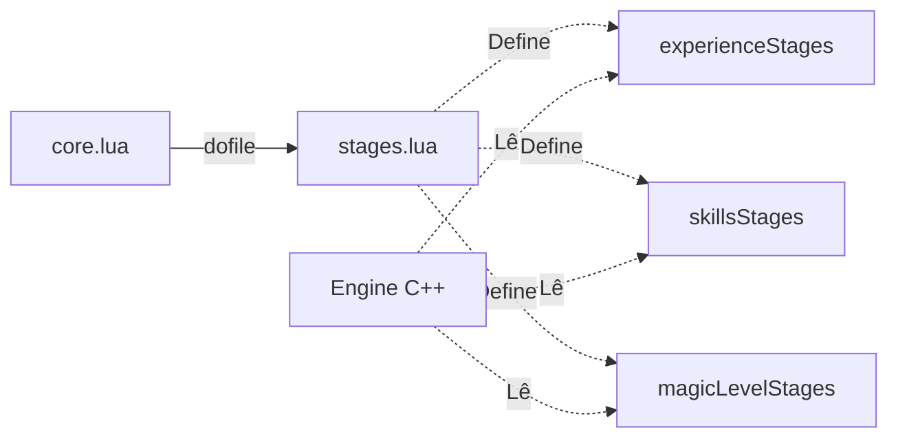

## 🛠️ Informações do Arquivo

Este arquivo define as tabelas de configuração para os "stages" (estágios) de experiência, skills e magic level. Ele é fundamental para o balanceamento da progressão dos jogadores no servidor, determinando quão rápido eles avançam em diferentes faixas de nível.

<ResponseField name="Caminho Original" type="path">
  `server/data/stages.lua`
</ResponseField>

<Tip>
  As alterações neste arquivo afetam diretamente a economia e a longevidade do servidor. Ajustes devem ser feitos com cautela para evitar desbalanceamento.
</Tip>

## 📄 Visão Geral do Código

### Resumo Executivo

O `stages.lua` contém tabelas globais que o motor do servidor utiliza para calcular os multiplicadores de ganho de experiência e habilidades. Ele permite criar uma curva de dificuldade progressiva, onde o ganho diminui à medida que o jogador fica mais forte.

### Fluxo de Execução

Este arquivo é carregado durante a inicialização pelo `core.lua`. As tabelas definidas aqui tornam-se globais e são consultadas internamente pelo motor C++ (Source) toda vez que um jogador ganha experiência ou treina uma habilidade.



### Análise das Tabelas de Configuração

Este arquivo não contém funções executáveis, mas sim definições de dados estruturados em tabelas Lua.

#### 1. experienceStages

Define a curva de experiência do servidor.

- **Estrutura**: Lista de objetos contendo `minlevel`, `maxlevel` (opcional) e `multiplier`.
- **Lógica**: O servidor verifica o nível atual do jogador, encontra a faixa correspondente e aplica o multiplicador sobre a experiência base do monstro.
- **Comportamento**: Se `maxlevel` não for definido, a faixa é considerada infinita (até o próximo stage ou para sempre).

#### 2. skillsStages

Define os multiplicadores para habilidades de combate físico (Fist, Club, Sword, Axe, Distance, Shielding).

- **Estrutura**: Similar a experienceStages.
- **Propósito**: Acelerar o treino em níveis baixos de skill e desacelerar em níveis altos para manter a competitividade.

#### 3. magicLevelStages

Define os multiplicadores para o Magic Level (Mana gasta).

- **Estrutura**: Similar a experienceStages.
- **Propósito**: Balancear a progressão de magos e o impacto do uso de mana/runas.

### Exemplo de Uso

Embora seja um arquivo de configuração, você pode acessar essas tabelas em scripts Lua para criar comandos personalizados, como um comando `!rates` para o jogador ver seus rates atuais.

```lua
-- Exemplo: Verificando o multiplicador atual de um jogador
local playerLevel = player:getLevel()
local currentRate = 1

for _, stage in pairs(experienceStages) do
    if playerLevel >= stage.minlevel and (not stage.maxlevel or playerLevel <= stage.maxlevel) then
        currentRate = stage.multiplier
        break
    end
end

player:sendTextMessage(MESSAGE_STATUS_CONSOLE_BLUE, "Seu rate de experiência atual é: " .. currentRate .. "x")
```

### Observações Técnicas

- **Dependência do Motor**: O nome das variáveis (`experienceStages`, `skillsStages`, `magicLevelStages`) é hardcoded no código fonte (C++) do servidor. Não renomeie estas tabelas.
- **Ordenação**: É recomendado manter as tabelas ordenadas do menor nível para o maior para facilitar a leitura e manutenção.
- **Sobreposição**: Evite faixas de níveis sobrepostas (ex: 1-100 e 50-150), pois isso pode causar comportamento imprevisível na seleção do multiplicador.

### Alertas

- ⚠️ **Sintaxe Lua**: Certifique-se de que todas as chaves e vírgulas estejam corretas. Um erro de sintaxe aqui impedirá o servidor de iniciar.
- ⚠️ **Stages Vazios**: Se a tabela for deixada vazia ou comentada, o servidor pode assumir rate 1x padrão ou apresentar erros no console.
- ⚠️ **Max Level**: Lembre-se que o último estágio geralmente não deve ter `maxlevel` definido, para garantir que jogadores de nível muito alto continuem recebendo experiência (mesmo que reduzida).